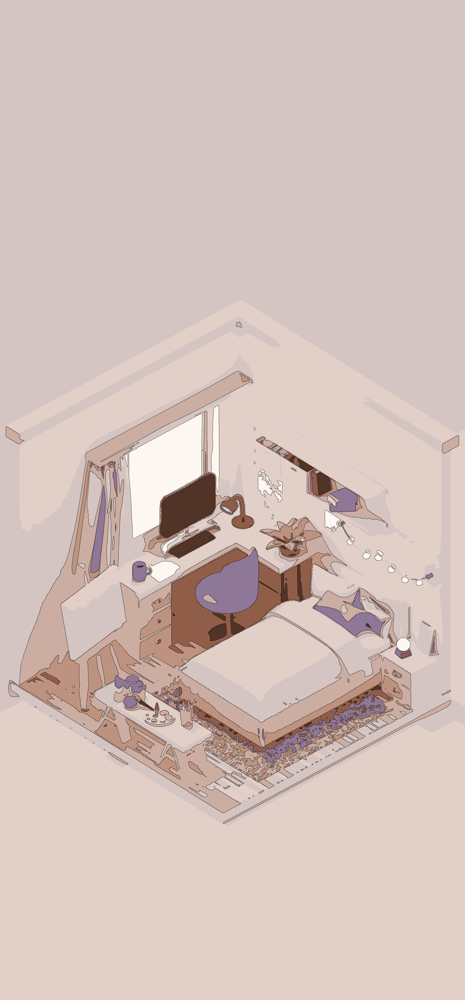

# Image Vectorization with Python

Convert raster images into stylized, vector-like artwork using machine learning techniques.

## 🎓 Project Background

Developed for **Application Design 2** course (4th semester Interaction Design) at **HfG Schwäbisch Gmünd**. Created to vectorize image sequences with consistent colors for animations.

**🔗 University Project:** [SideBy - HfG Exhibition](https://ausstellung.hfg-gmuend.de/s-2525/projekte/sideby/studiengang:ig)

## ✨ Key Features

- **🎨 Color Reduction** via K-means clustering
- **⚫ Black & White Mode** with customizable grey levels  
- **🎬 Sequence Processing** for consistent animation colors
- **📝 Edge Detection** for manga/anime style outlines
- **⚙️ Easy Configuration** - just edit settings at top of files

## �️ Before & After Examples

| Original | Vectorized |
|----------|------------|
|  |  |

### 🎨 Style Gallery

<table>
<tr>
<td align="center"><strong>Manga Style</strong><br></td>
<td align="center"><strong>Minimalist</strong><br></td>
<td align="center"><strong>Black & White</strong><br></td>
</tr>
<tr>
<td align="center"><strong>Thin Lines</strong><br></td>
<td align="center"><strong>No Edges</strong><br></td>
<td align="center"><strong>Simple B&W</strong><br></td>
</tr>
</table>

## �🚀 Quick Setup

```bash
pip install opencv-python numpy matplotlib scikit-learn scipy pillow
python examples.py  # See style gallery
```

## 🎯 Usage

### 1. **Explore Styles**
```bash
python examples.py
```
Check `examples/style_gallery/` for different artistic styles.

### 2. **Single Images**
Edit settings in `image_vectorizer.py`:
```python
DEFAULT_COLORS = 8         # Number of colors (2-50)
DEFAULT_BLACK_WHITE = False # True for B&W mode
DEFAULT_EDGE_THRESHOLD1 = 100  # Edge thickness
```
Then run: `python image_vectorizer.py`

### 3. **Image Sequences** (For animations)
Put images in `examples_image_sequence/room-animation/`
Edit `sequence_vectorizer.py`:
```python
SEQUENCE_COLORS = 6        # Colors for entire sequence
SEQUENCE_BLACK_WHITE = False # True for B&W sequences
```
Then run: `python sequence_vectorizer.py`

### 4. **Command Line**
```bash
python main.py --input "photo.jpg" --output "result.png" --colors 6 --black-white
```

## 🎨 Style Examples

See the [Style Gallery](#-style-gallery) above for visual examples of each style:

**Manga Style:** 6-8 colors, edges 30/100, B&W mode optional  
**Minimalist:** 3-4 colors, smoothing 3.0  
**Clean Lines:** 8-12 colors, edges 80/200

## � Main Files

- `image_vectorizer.py` - Main engine, edit settings here
- `sequence_vectorizer.py` - For consistent animation sequences  
- `examples.py` - Style gallery generator
- `main.py` - Command line interface

## � Key Settings

- **Colors:** 3-6 (minimal), 8-12 (balanced), 15+ (detailed)
- **Black & White:** Use 4-10 colors for grey levels
- **Edges:** 30/100 (thick manga), 80/200 (thin), 100/250 (minimal)

## License

MIT License - Feel free to use and modify for your own projects!
